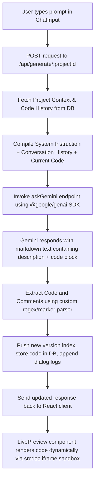

# 🚀 NxtBuild — Full-Stack AI-Powered Web App Builder

🔗 **Live Demo:** [nxt-build-h7bg.vercel.app](https://nxt-build-h7bg.vercel.app/)  
💻 **GitHub Repository:** [github.com/Deeraj749/NxtBuild](https://github.com/Deeraj749/NxtBuild)

NxtBuild is a premium, full-stack AI-powered web application builder built with the **MERN (MongoDB, Express, React, Node.js)** stack and integrated with **Google Gemini AI**. The platform enables developers and non-technical creators alike to build, preview, edit, version-control, and export fully functional single-page web applications using natural language.

---

## ✨ Features

- 💬 **Conversational AI Generator:** Chat with Google Gemini AI to describe your web application's requirements, features, and style.
- 💻 **Real-Time Code Sandbox:** Instantly compile and preview generated HTML, CSS, and JS components inside an interactive live sandbox.
- 📝 **Inline Source Code Editor:** Directly modify, refine, or refactor the generated source code with instant preview updates.
- 🕒 **Automatic Version History:** Revisit, compare, and rollback to any previous version of your generated code.
- 📂 **Multi-Project Dashboard:** Manage multiple web app build sessions, title your projects automatically, and delete them when done.
- 🔒 **Secure User Authentication:** User accounts, JWT cookies authentication, and secure password storage powered by `bcryptjs`.
- 📱 **Fully Responsive Layouts:** Sandbox view toggle modes (Desktop, Mobile, Tablet) to test layouts on various screen widths.

---

## 🛠️ Tech Stack & Libraries

### Frontend
- **Framework:** React 19 (Vite compilation bundle)
- **Routing:** React Router DOM (v7)
- **HTTP Client:** Axios
- **State Management:** React Context API (Auth Context)
- **Cookies & Storage:** `js-cookie`

### Backend
- **Platform:** Node.js, Express.js
- **Database:** MongoDB Atlas with Mongoose ODM
- **Security:** JSON Web Tokens (`jsonwebtoken`), `bcryptjs` hashing
- **CORS Management:** Express `cors` middleware

### AI Integration
- **SDK:** `@google/genai` (v1.44.0)
- **Model:** Google Gemini (Generative AI API integration)

---

## 📁 Repository Structure

```text
ai_powered_web_app_builder/
├── client/                   # React Frontend App
│   ├── public/               # Static assets
│   ├── src/
│   │   ├── components/       # UI Components (Chat, Editor, Preview, Navbar, Cards)
│   │   ├── context/          # React Auth Context for global state
│   │   ├── pages/            # View Pages (Landing, Login, Dashboard, Builder)
│   │   ├── services/         # API connection handlers
│   │   ├── styles/           # CSS design rules
│   │   ├── App.jsx           # App shell and routing configuration
│   │   └── main.jsx          # Entry point
│   ├── package.json          # Node dependencies and build scripts
│   └── vite.config.js        # Vite configurations
│
├── server/                   # Express Backend App
│   ├── src/
│   │   ├── config/           # Database and Gemini configuration initialization
│   │   ├── constants/        # Prompt templates (System prompts, Prompt builder)
│   │   ├── controllers/      # Route controllers (Auth, Generation, Project)
│   │   ├── middleware/       # JWT auth confirmation filter
│   │   ├── models/           # Mongoose schemas (User, Project)
│   │   ├── routes/           # Endpoint controllers router registry
│   │   ├── services/         # Core business logic handlers (Auth, Project, Gemini, Code Gen)
│   │   └── utils/            # Helper parsing methods (Response extractor)
│   ├── server.js             # Express startup file
│   └── package.json          # Node server packages configuration
│
├── dist/                     # Optimized production bundle
└── vercel.json               # Serverless cloud deployment configuration mapping
```

---

## 🚀 Getting Started

### Prerequisites
Make sure you have the following installed on your machine:
- **Node.js** (v18.x or above)
- **npm** (v9.x or above)
- **MongoDB** (Local instance or MongoDB Atlas cluster connection string)
- **Gemini API Key** (Obtained from Google AI Studio)

---

### Step-by-Step Installation

#### 1. Clone the repository
```bash
git clone https://github.com/Deeraj749/NxtBuild.git
cd NxtBuild
```

#### 2. Configure the Backend (Server)
Navigate to the server directory, install packages, and set up your environment configuration.
```bash
cd server
npm install
```

Create a `.env` file in the root of the `/server` folder matching the variables listed below:
```env
PORT=5000
MONGODB_URI=your_mongodb_connection_string
JWT_SECRET=your_jwt_secret_key_here
JWT_EXPIRES_IN=7d
GEMINI_API_KEY=your_google_gemini_api_key_here
CLIENT_URL=http://localhost:5173
```

Start the backend server in development mode:
```bash
npm run dev
```
*The server will start running at `http://localhost:5000`.*

---

#### 3. Configure the Frontend (Client)
In a new terminal window, navigate to the client folder, install packages, and set up variables.
```bash
cd client
npm install
```

Create a `.env` file in the root of the `/client` folder:
```env
VITE_API_URL=http://localhost:5000
```

Start the React Vite application:
```bash
npm run dev
```
*The React app will be live at `http://localhost:5173`.*

---

## 🔑 Environment Variables Reference

### Backend (`/server/.env`)
| Variable Name | Description | Example Value |
| :--- | :--- | :--- |
| `PORT` | Local Express Server Listening Port | `5000` |
| `MONGODB_URI` | MongoDB Connection URL string | `mongodb+srv://...` |
| `JWT_SECRET` | Secret token signing key | `secure_secret_key_123` |
| `JWT_EXPIRES_IN` | Duration before authentication token validation expires | `7d` |
| `GEMINI_API_KEY` | Developer Google Gemini AI access token | `AIzaSy...` |
| `CLIENT_URL` | Cross-Origin resource sharing permitted Client endpoint | `http://localhost:5173` |

### Frontend (`/client/.env`)
| Variable Name | Description | Example Value |
| :--- | :--- | :--- |
| `VITE_API_URL` | Base API target URL for Axios connections | `http://localhost:5000` |

---

## 📡 API Endpoints Documentation

All root paths are registered behind `/api` prefix (e.g. `http://localhost:5000/api`).

### 1. Authentication (`/api/auth`)
| HTTP Method | Route | Description | Auth Required? | Request Body |
| :--- | :--- | :--- | :--- | :--- |
| **POST** | `/register` | Registers a new account | No | `{ "name", "email", "password" }` |
| **POST** | `/login` | Signs in the user, returns cookie JWT | No | `{ "email", "password" }` |
| **GET** | `/me` | Returns logged-in user profile details | Yes (JWT) | *None* |
| **POST** | `/logout` | Invalidates current cookie session state | Yes (JWT) | *None* |

### 2. Projects (`/api/projects`)
| HTTP Method | Route | Description | Auth Required? | Request Body / Params |
| :--- | :--- | :--- | :--- | :--- |
| **GET** | `/` | Retrieves all projects owned by the user | Yes (JWT) | *None* |
| **POST** | `/` | Creates a new blank project | Yes (JWT) | `{ "title" }` |
| **GET** | `/:id` | Fetches details and versions of a specific project | Yes (JWT) | `id` (URL parameter) |
| **PUT** | `/:id` | Updates project source code or title manually | Yes (JWT) | `{ "title", "generatedCode" }` |
| **DELETE** | `/:id` | Deletes a project from database persistently | Yes (JWT) | `id` (URL parameter) |

### 3. Code Generation (`/api/generate`)
| HTTP Method | Route | Description | Auth Required? | Request Body / Params |
| :--- | :--- | :--- | :--- | :--- |
| **POST** | `/:projectId` | Requests Gemini AI to generate/update project code | Yes (JWT) | `{ "prompt" }` |

---

## ⚙️ How Code Generation Works Under the Hood



### Prompt Engineering Guidelines
The backend wraps all generation requests with a `SYSTEM_PROMPT` containing specific guardrails:
1. **Single-File Compilation:** Generates a unified HTML file enclosing JavaScript (in `<script>`) and styling rules (in `<style>`).
2. **CDN/Resource Isolation:** Uses inline shapes, CSS graphics, or dynamic SVG content rather than external placeholder links or scripts unless requested.
3. **Format Integrity:** Responses are parsed using standardized markers:
   - Explanations are written in text blocks.
   - Code must be encapsulated inside ` ```html ` blocks.

---

## 📦 Deployment

### Deploying to Vercel

The workspace is configured for direct Vercel deployment with customized rules in the root and server folders:

#### Backend Server Setup on Vercel
1. Set up a project mapping to the `/server` folder.
2. Ensure `vercel.json` contains:
```json
{
  "version": 2,
  "builds": [
    {
      "src": "server.js",
      "use": "@vercel/node"
    }
  ],
  "routes": [
    {
      "src": "/(.*)",
      "dest": "server.js"
    }
  ]
}
```
3. Inject the production env values inside Vercel Dashboard Settings under environment variables.

#### Client Setup on Vercel
1. Deploy project routing path from client.
2. In the Client Build settings, specify:
   - **Framework Preset:** Vite
   - **Build Command:** `npm run build`
   - **Output Directory:** `dist`
3. Configure target environment `VITE_API_URL` to match your deployed Server URL.

---

## 📄 License

This project is licensed under the ISC License. 